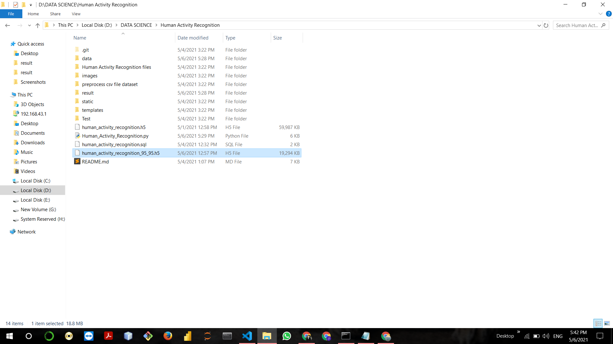

# Human-Activity-Recognition-using-Transfer-Learning

<h2>Unpreprocess kinetic 400 Dataset link:- https://deepmind.com/research/open-source/kinetics </h2>

<h2> Preprocess Dataset Link : https://drive.google.com/file/d/1Es0IpYDY3k71kz9FpW2p5AGbCIk5I_qu/view?usp=sharing </h2>

<h2> 1. Download pretrained model (ImageNet) :  https://drive.google.com/file/d/1jHuW1oZ39Uxjk-v3zKh7tmmCVSrZ4jtH/view?usp=sharing <h2>

<h2> 2. Download pretrained model (VGG16) : https://drive.google.com/file/d/11tqGeByuntORoOJe7KLtouUD-kGpLzLN/view?usp=sharing</h2>

<h4>
1. Download pretrained model (ImageNet) : This is a trained model. It is giving 95% accuracy on the training data and 96% accuracy on the validation data. I'll Recommend you to use this model.  
2. Download pretrained model (VGG16) : This is a trained model. It is giving 90% accuracy on the training data and 91% accuracy on the validation data.
</h4>

Click on the preprocess dataset link. You will get Train_Test_video_classifier.zip file. After extract the datatset. You will get two folders training and validation. Both folders contain 45-45 category folders.

<h1> Category name of Training and Validation</h1>

Name of Activity 
1. Paragliding 
2. Catching or Throwing Baseball
3. Dancing Macarena 
4. Laughing 
5. Eating Cake 
6. Beatboxing 
7. Feeding Birds 
8. Opening Present 
9. Swinging On Something 
10. Making Pizza
11. Kitesurfing 
12. Ice Climbing
13. Slacklining
14. Chopping Wood 
15. Cartwheeling 
16. Archery
17. Welding
18. Roller Skating 
19. Playing Flute 
20. Deadlifting 
21. Bouncing On Trampoline 
22. Shoveling Snow 
23. Playing Keyboard 
24. High Jump 
25. Celebrating 
26. Capoeira
27. Finger Snapping 
28. Side Kick 
29. Brushing Hair
30. Cooking Sausages 
31. Throwing Ball 
32. Dribbling Basketball
33. Hammer Throw 
34. Stretching Leg 
35. Breakdancing 
36. Snowmobiling 
37. Headbanging 
38. Exercising With an Exercise Ball 
39. Blowing Out Candles 
40. Canoeing or Kayaking 
41. Watering Plants 
42. Milking Cow 
43. Snowboarding 
44. Driving Car 
45. Cheerleading

<h1>Training and Validation </h1>

<h1>Training folder contains 45 categories </h1>

<h1>Validation folder contains 45 categories </h1>

<h1> Introduction </h1>
Now in human activity recognition files's folder, You will get 5 files. Firstly we extract 15-15 videos's id, label, start time and end time of 45 category from thousands of videos's data, then we'll check that which video is private or which video is public. So we'll remove the private video's data and keep the public videos's data. And in preprocessing, we download videos of each category one by one then trim the video for 10 sec according to the start time and end time which is given in the training.csv file. Then we convert the videos into frames (images). Then move the images to a particular category folder and do for all the categories and make a training folder and move all category folders into it. And do same for the validation. The ratio of training and validation is 80:20. That means 80% data in the training and 20% data in the validation. After preparing the dataset, now we start the training of our model. After train the model for 30 epochs, you will get 95% accuracy on the training data and 96% accuracy on the validation data. Now it’s time for testing the model. We test a model on video to recognize the human activity. So for testing, we convert the video into frames then classify all the frames, then make a video with the help of all the frames. You will get all the process in the folder of human activity recognition files.

<h4>The steps for train the model and sequence for use the files are:-</h4>

1. Extract 15-15 Videos from training and validation.ipynb
2. Remove Private keep public.ipynb
3. Prepoccess_training_videos.ipynb
4. Prepoccess_validation_videos.ipynb
5. HUMAN_ACTIVITY_RECOGNIZTION_TRAINING.ipynb

<h3> Process to run file: </h3>

1. Extract 15-15 Videos from training and validation.ipynb : Change the name of the class when appending into the new dataframe. And simply save the training dataframe. You will get 675 data rows of 45 category. and do for same validation, You will get 675 data rows of 45 category. Then save the validation dataframe. 

2. Remove Private keep public.ipnyb : For remove the private and keep public video data, Just execute the loop from 0 to len(data). Then you will get all private videos's list. Then remove private videos and save the training dataframe and do for same as validation.

3. Prepoccess_training_videos.ipnyb: download one by one category videos which means download 15 videos in one time. Then trim all the videos. Then you will get the list of untrimmed video. Then again try to trim the remainig videos. Then convert the videos into the frames. For example- if you have 15 or less than 15 trimmed video of celebrating class then make a celebrating folder then convert all the trimmed videos into frames(images) then move all the frames into the celebrating folder and do all for same.

4. Prepoccess_training_videos.ipnyb: download one by one category videos which means download 15 videos in one time. Then trim all the videos. Then you will get the list of untrimmed video. Then again try to trim the remainig videos. Then convert the videos into the frames. For example- if you have 15 or less than 15 trimmed video of celebrating class then make a celebrating folder then convert all the trimmed videos into frames(images) then move all the frames into the celebrating folder and do all for same.

After doing 3rd and 4rd step, Make a zip file of complete data.

5. HUMAN_ACTIVITY_RECOGNIZTION_TRAINING.ipnyb : Copy data.zip file into Google colab which stores the training and validation folder and in each folder, 45 catefory folders are available and move all validation images to training, then training and inside training, 45 categories folders store total data. So divide data into training and validation. 80% data in training and 20% data in validation. This process done for divide the data into 80:20 ratio because we had the data of 50:50 ratio. Then simple execute remaining code to train the model.

<h3>Deployment using python's framework flask:-</h3>

<h4> There are four folders and two files you will get: </h4>

1. Static: Static folder store the JavaScript file, css file and images.
2. Template: Template folder store all web pages.
3. Test: Test folder store the testing videos.
4. Result: Result folder store the result video.
5. preprocess csv file dataset : This folder contain preprocess csv files.
6. Data: Data is a extra folder which is created at the running time, Data folder stores the video’s frames temporary.
7. Human_Activity_Recognition.py file is our python file.
8. human_activity_recognition_95_95.h5 is our pre trained model to classify human activity in video.
9. human_activity_recognition.sql is a database for feedback. just import in the xampp or wampp server.

 You just simply run the Human_Activity_Recognition.py file then you will get a link like (http://127.0.0.1:5000) then copy and paste this ink into any browser. Then you can use the project.
 
<h3> Note : Make sure before running the project, see a hierarchy of project. You'll also have to setup like below image and for use the feedback form in project, You import the human_activity_recognition.sql file in xampp or wampp server. For importing (Go to new -> Create dataset with name (human_activity_recognition) -> click on import -> choose file -> choose human_activity_recognition.sql file -> click on Go-> Done </h3>

<h1> Flask application setup </h1>

<h1>Overview of Deployement of Human Activity Recognition</h1>

<h1>Page 1 : Home</h1>

<h1>Page 1 : Home (remaining)</h1>

<h1>Page 2 : Feedback</h1>

<h1> Thank You!!!!!!!!!!!!!!!!! </h1>

<video width="320" height="240" controls>
  <source src="results/1307489.avi" type="video/avi">
  <source src="movie.ogg" type="video/ogg">
  Your browser does not support the video tag.
</video>

